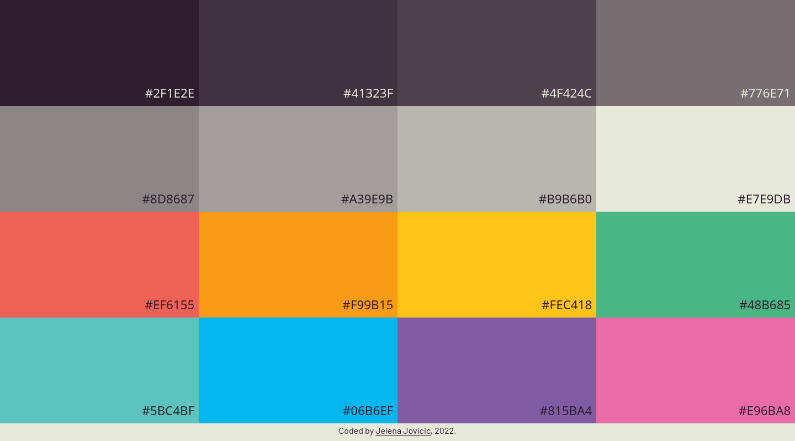

# Paraiso colors hex codes

A simple [Flat UI Colors 2](https://flatuicolors.com/) clone, featuring "Paraiso" colors from the colorful illustrations by Brazilian artist [Rubens LP](http://www.rubenslp.com.br/). Click to copy hex codes.

## Table of contents

- [Overview](#overview)
  - [Description](#description)
  - [Screenshot](#screenshot)
  - [Links](#links)
- [My process](#my-process)
  - [Built with](#built-with)
  - [Credits](#credits)
- [Author](#author)

## Overview

### Description

I keep coming back to these colors, and needed some simple interface to copy the codes.

### Screenshot

### Links

- [Repo](https://github.com/je-jo/paraiso-colors)
- [Live Site](https://je-jo.github.io/paraiso-colors/)

## My process

### Built with

- Semantic HTML5 markup
- CSS custom properties
- CSS Grid
- CSS Flexbox
- Mobile-first workflow
- Javascript

### Credits

- [Flat UI Colors 2](https://flatuicolors.com/)
- [Colors from Paraiso theme](https://github.com/idleberg/Paraiso-Color-Palettes)
- [Box Shadows](https://box-shadow.dev/) A fun and useful tool for playing around with box shadows.

## Author

- [Github](https://github.com/je-jo)
- [Frontend Mentor](https://www.frontendmentor.io/profile/je-jo)
- [Codepen](https://codepen.io/je-jo)
- [Twitter](https://twitter.com/jelena_jo_)